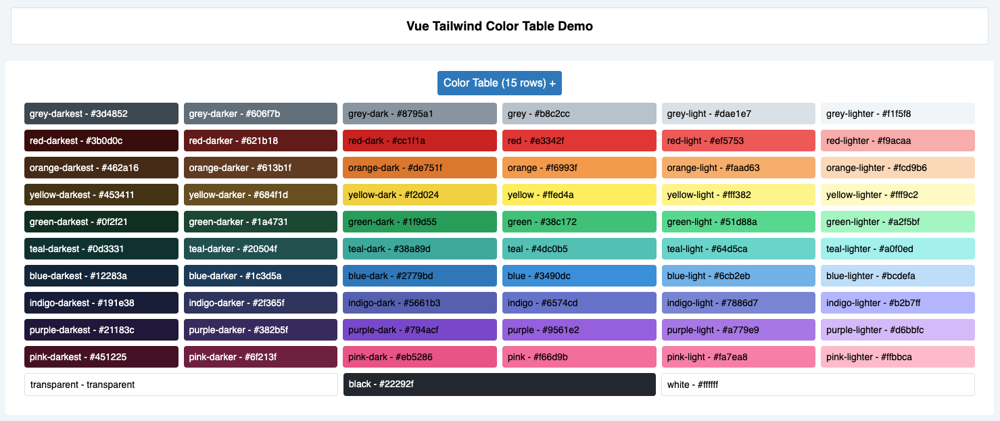

# vtw-color-table

A TailwindCSS color palette viewer using VueJS

[](https://github.com/PeterDKC/vtw-color-table)


If you're like me, you open up your Tailwind.js file, look at a big blob of Hex codes, and say, "Yeah but what do they look like?..."

This package lets you easily drop a Vue component into your site to see a list of your colors in a clean pretty table.



## Installation

`npm i --save @peterdkc/vtw-color-table`

## Usage

### Via npm

In e.g. `app.js`, import the global component and tell your app where to find your `tailwind.js` file, relative to your main JavaScript file:

```
// import Vue from 'vue';

import '@peterdkc/vtw-color-table';

window.tailwindColors = require('../../tailwind.js').colors;

// new Vue({el: '#app'});
```

In a page / your app layout file:

```
<vtw-color-table></vtw-color-table>
```
